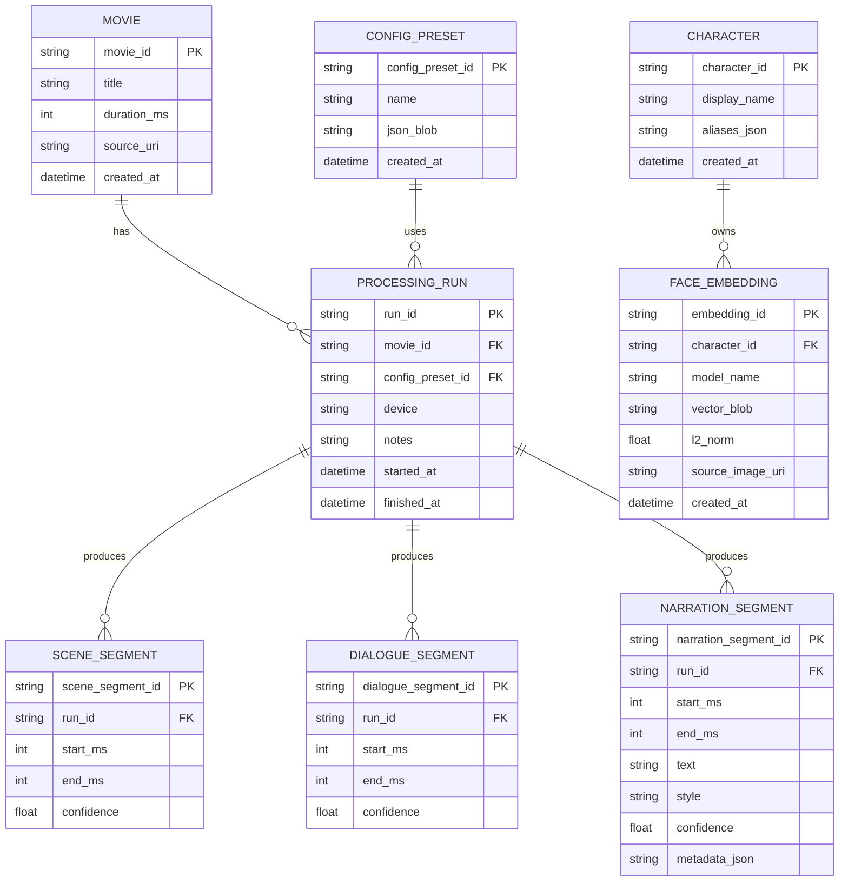

# Blind-Friendly Movie Narration System (Phase 1) ERD

This ERD describes the core data structures for "Character Store, Processing Run, Time Segment Artifacts" in Phase 1. Storage can use SQLite/PostgreSQL; Phase 1 can use SQLite for convenient local development.

## 1. Mermaid ER Diagram

## 2. Description
- `CHARACTER` + `FACE_EMBEDDING`: Character database and their face feature vectors (supports multiple samples).
- `PROCESSING_RUN`: A single processing run, facilitating traceability of configuration and performance.
- `SCENE_SEGMENT`/`DIALOGUE_SEGMENT`/`NARRATION_SEGMENT`: Core results generated along the timeline.

