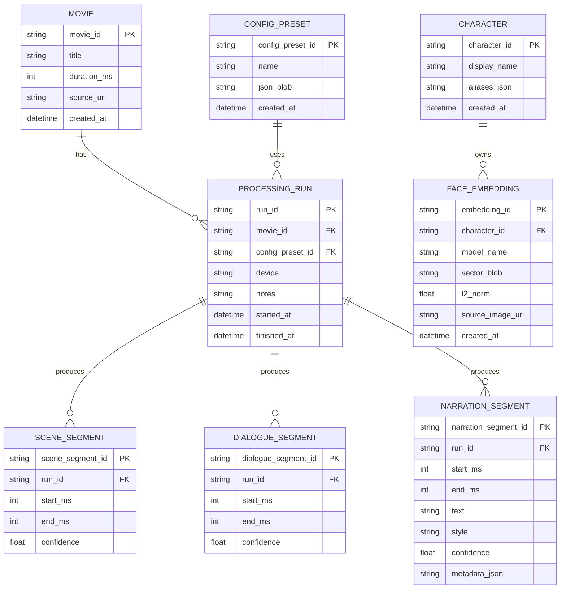

# 盲人电影解说系统（一期）ERD

本ERD用于描述一期工程中“角色库、处理运行、时间片段产物”等核心数据结构。存储可使用 SQLite/PostgreSQL；一期可先用 SQLite 方便本地开发。

## 1. Mermaid ER 图

## 2. 说明

- `CHARACTER` + `FACE_EMBEDDING`：角色库与其人脸特征向量（可多个样本）。
- `PROCESSING_RUN`：一次处理运行，便于追溯配置与性能。
- `SCENE_SEGMENT`/`DIALOGUE_SEGMENT`/`NARRATION_SEGMENT`：按时间轴产出的核心结果。
